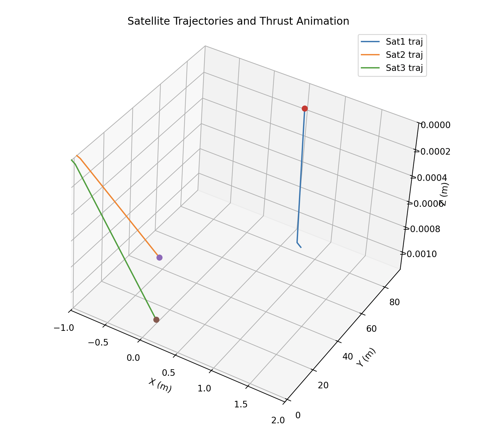

# Satellite Collision Avoidance Web App

[](https://opensource.org/licenses/MIT)

A web-based interface for optimizing satellite trajectories to prevent collisions while minimizing fuel consumption. Built with Python/Gurobi for optimization and Three.js for 3D visualization.



### Fuel Minimization Objective
```math
\text{Minimize } \sum_{i=1}^N \sum_{t=0}^{T-1} \delta_{i,t} \quad \text{where } \delta_{i,t} \geq c_{\text{fuel}} \sum_{a \in \{x,y,z\}} |u_{i,t}^a|
```

## Features
- Interactive 3D visualization of satellite trajectories
- Configurable safety margins and thrust limits
- Real-time MILP optimization backend
- Scenario export/import in JSON format

## Problem Formulation
### Orbital Dynamics
For satellite $i$ at time $t$ with mass $m_i$ and thrust $\mathbf{u}_{i,t}$:

```math
\begin{aligned}
\mathbf{p}_{i,t+1} &= \mathbf{p}_{i,t} + \mathbf{v}_{i,t} \Delta t + \frac{1}{2m_i} \mathbf{u}_{i,t} (\Delta t)^2 \\
\mathbf{v}_{i,t+1} &= \mathbf{v}_{i,t} + \frac{1}{m_i} \mathbf{u}_{i,t} \Delta t
\end{aligned}
```

### Collision Avoidance
For all satellite pairs $(i,j)$ and times $t \geq 1$:
```math
\begin{aligned}
|p_{i,t}^x - p_{j,t}^x| &\geq d_{\text{safe}} \cdot b_{ij,t}^x \\
|p_{i,t}^y - p_{j,t}^y| &\geq d_{\text{safe}} \cdot b_{ij,t}^y \\
|p_{i,t}^z - p_{j,t}^z| &\geq d_{\text{safe}} \cdot b_{ij,t}^z \\
b_{ij,t}^x + b_{ij,t}^y + b_{ij,t}^z &\geq 1 \quad (b_{ij,t}^a \in \{0,1\})
\end{aligned}
```

### Additional Resources

For a comprehensive explanation of the problem statement, including mathematical formulations and assumptions, refer to the [Problem Statement](./assets/problem_statement.md). This document provides in-depth details about the orbital dynamics, collision avoidance constraints, and optimization objectives used in this project.


